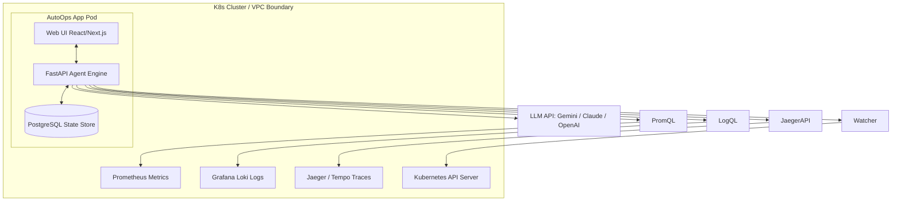
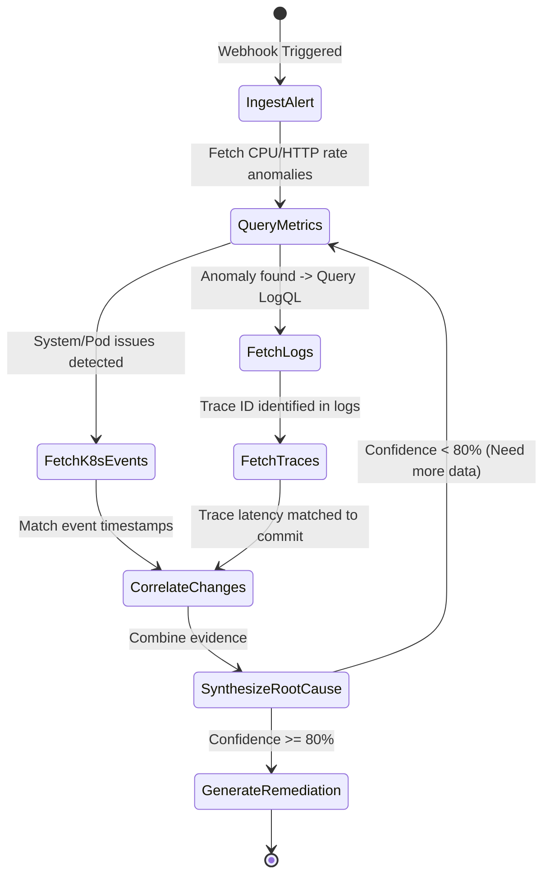

# 🛡️ AutoOps: AI-Powered Incident Commander

<div align="center">

[](#)
[](#)
[](#)
[](#)
[](#)
[](#)

**An evidence-based reasoning engine that correlates metrics, logs, traces, and deployment events to resolve production outages in seconds.**

[📖 Read the Full Specification](docs/specs.md) · [🚀 Quick Start](#-quick-start) · [🗺️ Roadmap](#%EF%B8%8F-roadmap--milestones)

</div>

---

## ⚡ The Problem

When production outages strike, SREs and developers waste critical minutes (often hours) manually jumping between multiple dashboards:
- Digging through **Prometheus** spikes to find the affected service.
- Filtering logs in **Grafana Loki** looking for exception stack traces.
- Exploring **Jaeger** request paths for bottlenecks.
- Checking **Kubernetes events** and **Git deployment histories** to see what changed.

**AutoOps acts as a self-hosted Incident Commander, automating this entire diagnostic workflow.**

---

## 🌟 Core Features

- **🌐 CNCF-Native Ingestion:** Plugs directly into your existing observability stack (Prometheus, Loki, Jaeger, and Kubernetes API).
- **🧠 LangGraph-Powered Agent:** Implements a state-graph reasoning agent that dynamically executes Prometheus PromQL, Loki LogQL, and trace lookups based on intermediate evidence.
- **🔍 Log-to-Trace Correlation:** Auto-extracts trace IDs from error logs to map anomalous spans back to corresponding exceptions.
- **🔒 Local PII Redaction:** High-performance local regex and NER engines sanitize logs (scrubbing emails, tokens, and credentials) before sending prompts to external LLMs.
- **📊 Interactive Visualizer:** A dark-mode Web UI dashboard showing the exact step-by-step reasoning tree the AI used during its investigation.
- **🛠️ Actionable Runbooks:** Recommends dry-run commands or config rollbacks for engineers to execute with a single click.

---

## 🏗️ System Architecture



---

## 🧠 LangGraph Troubleshooting Cycle

AutoOps models the troubleshooting journey as a **directed state graph**. When an incident fires, the agent loops iteratively between telemetry query nodes until it reaches a high-confidence diagnosis:



---

## 🚀 Quick Start

### 1. Run Locally (Development Mode)

Prerequisites: Python 3.11+, Node.js 18+.

```bash
# Clone the repository
git clone https://github.com/ayush-ranjan/autoops.git
cd autoops/AutoOps

# Start backend FastAPI app
cd backend
python -m venv venv
source venv/bin/activate
pip install -r requirements.txt
uvicorn app.main:app --reload --port 8000

# Start frontend Next.js app (in a separate terminal)
cd ../frontend
npm install
npm run dev
```

### 2. Deploy to Kubernetes (Helm)

```bash
helm repo add autoops https://helm.autoops.sh
helm install autoops autoops/autoops \
  --namespace autoops \
  --create-namespace \
  --set env.LLM_PROVIDER="gemini" \
  --set env.LLM_API_KEY="your-api-key"
```

---

## 🛡️ Security & Privacy First

We understand that logs and trace data are highly sensitive.
* **No Telemetry Leaves Your VPC:** All raw database queries, log scanning, and trace analysis happen locally inside the AutoOps pod.
* **PII Redaction:** AutoOps strips emails, passwords, access keys, and IP addresses using high-speed local processors before sending summaries to the LLM.
* **Read-Only Permissions:** The default service account has read-only cluster access. AutoOps will never perform code changes or restarts without manual operator confirmation.

---

## 🗺️ Roadmap & Milestones

- [ ] **Milestone 1: Telemetry Connectors** (Prometheus PromQL, Loki LogQL, Jaeger REST API).
- [ ] **Milestone 2: LangGraph Loop** (Troubleshooting state graph, dynamic query tools, local PII engine).
- [ ] **Milestone 3: React Dashboard** (Interactive graph visualizer, log timeline viewer, manual remediation executor).
- [ ] **Milestone 4: Cloud Deployments & Slack Integrations** (AWS EKS & GCP GKE Terraform files, Slack ChatOps Bot).

---

## 📄 License

Distributed under the Apache 2.0 License. See `LICENSE` for more information.
