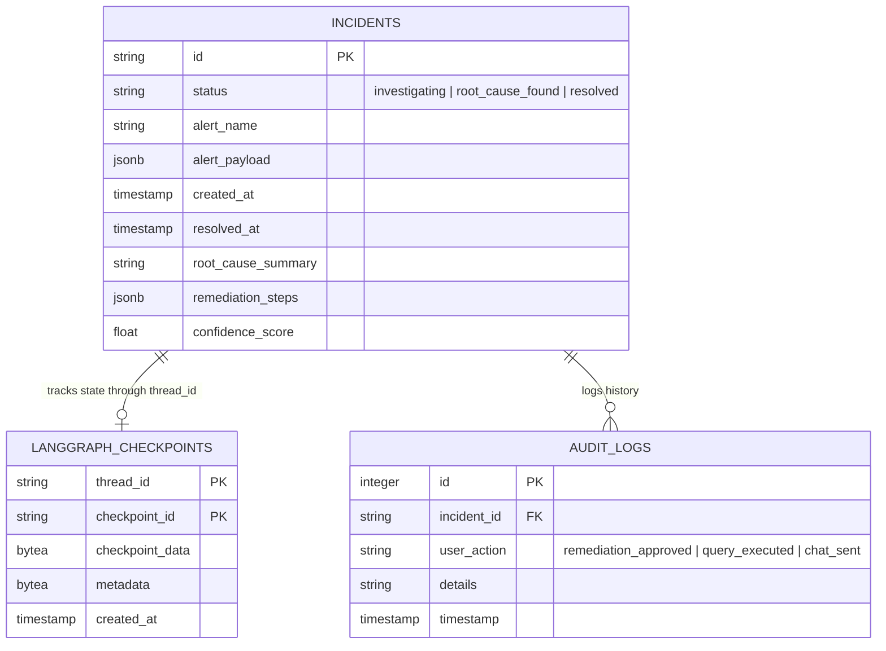

# AutoOps System Design Document

This document outlines the detailed system design, directory layout, database schema, data models, backend API routers, LangGraph agent workflows, and front-end dashboard structure for **AutoOps**.

---

## 1. Directory Structure

AutoOps is structured as a monorepo containing backend (Python FastAPI) and frontend (Next.js React) code bases.

```text
AutoOps/
├── backend/
│   ├── app/
│   │   ├── __init__.py
│   │   ├── main.py              # Application entrypoint & middlewares
│   │   ├── config.py            # Environment configurations (Pydantic Settings)
│   │   ├── database.py          # SQLAlchemy engine & session maker
│   │   ├── models/
│   │   │   ├── __init__.py
│   │   │   ├── incident.py      # SQLAlchemy schemas for Incidents & Audits
│   │   ├── schemas/
│   │   │   ├── __init__.py
│   │   │   ├── incident.py      # Pydantic validation models
│   │   ├── routers/
│   │   │   ├── __init__.py
│   │   │   ├── webhook.py       # Ingestion of Alertmanager/CI webhooks
│   │   │   ├── incidents.py     # CRUD and detail fetch for incidents
│   │   │   ├── agent.py         # Trigger/Resume LangGraph agent manually
│   │   ├── connectors/
│   │   │   ├── __init__.py
│   │   │   ├── base.py          # Base telemetry connector interface
│   │   │   ├── prometheus.py    # Prometheus client connection
│   │   │   ├── loki.py          # Grafana Loki client connection
│   │   │   ├── jaeger.py        # Jaeger HTTP client connection
│   │   │   ├── k8s.py           # Kubernetes API client connection
│   │   ├── services/
│   │   │   ├── __init__.py
│   │   │   ├── agent_engine.py  # LangGraph state machine & agent runtimes
│   │   │   ├── scrubber.py      # Local PII & secret redactor
│   │   │   ├── correlation.py   # Metrics/logs correlation processor
│   ├── requirements.txt
│   ├── Dockerfile
├── frontend/
│   ├── components/
│   │   ├── IncidentList.tsx     # Incident overview cards
│   │   ├── Visualizer.tsx       # Interactive LangGraph visualization (React Flow)
│   │   ├── RootCauseCard.tsx    # Markdown summary & recommendations panel
│   │   ├── AgentChat.tsx        # Dynamic conversational debugger pane
│   ├── pages/
│   │   ├── _app.tsx
│   │   ├── index.tsx            # Dashboard entrypoint
│   │   ├── incident/[id].tsx    # Detailed incident workspace
│   ├── styles/
│   │   ├── globals.css
│   ├── package.json
│   ├── Dockerfile
├── docs/
│   ├── specs.md                 # High-level product specifications
│   ├── DESIGN.md                # System design document (this file)
└── docker-compose.yml           # Local dev orchestrator (FastAPI, React, SQLite/PostgreSQL)
```

---

## 2. Database Schema

AutoOps utilizes PostgreSQL (production) or SQLite (local development) to persist incident history and LangGraph checkpointer state (to support agent pauses/resumes).



---

## 3. Data Models (Schemas)

### Pydantic Validation Schemas
```python
from pydantic import BaseModel, Field
from typing import List, Optional, Dict, Any
from datetime import datetime

class AlertmanagerAlert(BaseModel):
    status: str
    labels: Dict[str, str]
    annotations: Dict[str, str]
    startsAt: datetime
    endsAt: Optional[datetime] = None
    generatorURL: str

class WebhookPayload(BaseModel):
    receiver: str
    status: str
    alerts: List[AlertmanagerAlert]
    groupLabels: Dict[str, str]
    commonLabels: Dict[str, str]
    commonAnnotations: Dict[str, str]
    externalURL: str

class IncidentResponse(BaseModel):
    id: str
    status: str
    alert_name: str
    created_at: datetime
    resolved_at: Optional[datetime] = None
    root_cause_summary: Optional[str] = None
    remediation_steps: List[str] = []
    confidence_score: float = 0.0

    class Config:
        from_attributes = True
```

---

## 4. Backend Routing & FastAPI Architecture

### Webhook Router (`app/routers/webhook.py`)
- Receives HTTP POST alerts from Prometheus Alertmanager.
- Validates the JSON payload using Pydantic.
- Creates an entry in the `incidents` database table.
- Asynchronously spawns the LangGraph background task for the target incident.

### Incidents Router (`app/routers/incidents.py`)
- Provides pagination, query filtering, and status updates for the dashboard.
- Serves detail endpoints `/api/incidents/{id}` returning telemetry logs, graph paths, and summaries.

---

## 5. LangGraph Agent Runtime

The reasoning loop runs inside a LangGraph compiled graph. 

### A. Graph Definition
```python
from langgraph.graph import StateGraph, END
from app.services.agent_engine import IncidentState

def build_troubleshooting_graph() -> StateGraph:
    workflow = StateGraph(IncidentState)

    # Register Nodes
    workflow.add_node("initialize", initialize_node)
    workflow.add_node("query_metrics", query_metrics_node)
    workflow.add_node("query_logs", query_logs_node)
    workflow.add_node("query_traces", query_traces_node)
    workflow.add_node("query_k8s_events", query_k8s_events_node)
    workflow.add_node("correlate_deployments", correlate_deployments_node)
    workflow.add_node("synthesize_root_cause", synthesize_root_cause_node)

    # Set Entry Point
    workflow.set_entry_point("initialize")

    # Add Directed Transitions
    workflow.add_edge("initialize", "query_metrics")
    
    # Conditional Edges (routing logic based on LLM/Rule outputs)
    workflow.add_conditional_edges(
        "query_metrics",
        route_after_metrics,
        {
            "logs": "query_logs",
            "k8s_events": "query_k8s_events",
            "synthesize": "synthesize_root_cause"
        }
    )
    workflow.add_conditional_edges(
        "query_logs",
        route_after_logs,
        {
            "traces": "query_traces",
            "deployments": "correlate_deployments",
            "synthesize": "synthesize_root_cause"
        }
    )
    workflow.add_edge("query_traces", "correlate_deployments")
    workflow.add_edge("query_k8s_events", "correlate_deployments")
    workflow.add_edge("correlate_deployments", "synthesize_root_cause")

    workflow.add_conditional_edges(
        "synthesize_root_cause",
        should_stop,
        {
            "continue": "query_metrics",
            "end": END
        }
    )

    return workflow.compile()
```

---

## 6. Frontend Components & Interactivity

The frontend requires an interactive dashboard to visualize the graph execution.

### Node Rendering in React Flow
We represent each node in the LangGraph execution path as a customized card:
- **Metrics Node:** Displays the generated PromQL and a mini-chart rendering CPU/error spikes.
- **Logs Node:** Displays the target LogQL query and lines highlighting error trace matches.
- **Traces Node:** Renders trace span hierarchies showing long-tail latency.
- **Synthesize Node:** Highlights the text summary generated by the LLM.

```text
+-------------------------------------------------------------+
| Incident Details: P0 - HTTP 500 Spike in gateway            |
+-------------------------------------------------------------+
|                                                             |
|   [React Flow Graph Area]                                   |
|   (Initialize) -> (Query Metrics) -> (Query Logs)           |
|                         |                  |                |
|                         v                  v                |
|                   (K8s Events)     (Query Traces)           |
|                         \                  /                |
|                          v                v                 |
|                       (Correlate Deployments)               |
|                                 |                           |
|                                 v                           |
|                      (Synthesize Root Cause)                |
|                                                             |
+-------------------------------------------------------------+
| Root Cause Summary:                                         |
| Deployment of "gateway-v2.1" triggered a DB connection      |
| pool leak, leading to exhaustion.                           |
|                                                             |
| Recommendations:                                            |
| [ Run: kubectl rollout undo deployment/gateway ]            |
+-------------------------------------------------------------+
```

---

## 7. Security: PII Redaction Pipeline

To protect sensitive telemetry data before passing it to LLM endpoints, the `ScrubberService` runs locally in the background loop:

1. **Tokenization & RegEx Filtering:**
   - Detects standard formats: Email addresses, IP Addresses, Credit Cards, JWTs, Bearer Tokens, Database URIs, passwords.
2. **Replacement Strategy:**
   - Replaces matched strings with generic tags: `[REDACTED_EMAIL]`, `[REDACTED_IP]`, `[REDACTED_SECRET]`.
3. **Execution Context:**
   - Raw queries and responses are scrubbed inside the backend services layer immediately before being appended to the `IncidentState` message history.
