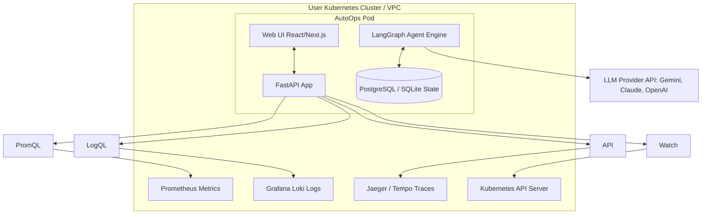
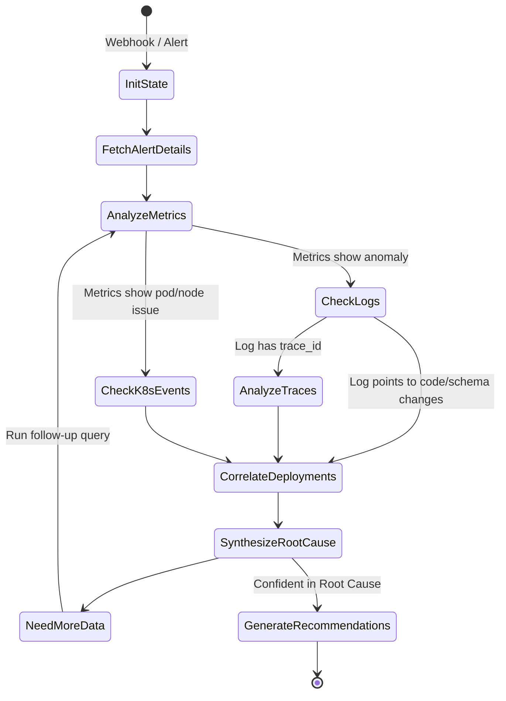

# AutoOps Product Specification

AutoOps is an AI-powered, self-hosted incident commander designed to automate production debugging. By ingesting telemetry from Kubernetes cluster environments, AutoOps correlates metrics, logs, traces, and deployment change events. Using a LangGraph-based agentic reasoning loop, it identifies the root causes of incidents and recommends actionable resolution pathways.

---

## 1. System Overview & Core Mission

When production systems fail, engineers spend critical minutes (or hours) manually executing queries across disconnected dashboards (Grafana, Jaeger, Kubernetes terminal, Git commits). 

**AutoOps** automates this manual triage process:
1. **Detects/Ingests Alert:** Triggers automatically via Alertmanager webhook or manual developer invocation.
2. **Executes Investigation Loop:** Runs an iterative LangGraph agent that queries Prometheus, Loki, OpenTelemetry, and Kubernetes API to gather context.
3. **Correlates Data:** Links metrics anomalies, error logs, and distributed trace spans to change events (e.g., a git commit deployment).
4. **Delivers Root Cause & Remediation:** Explains the failure in a clean Web UI and suggests precise remediation actions (e.g., rollback command, database index suggestion).

---

## 2. System Architecture

The following diagram illustrates the network boundary and the relationship between the self-hosted AutoOps components and the user's infrastructure:



---

## 3. LangGraph Agentic Reasoning Loop

AutoOps uses a directed cyclic state graph built with **LangGraph** to model the troubleshooting workflow. Rather than a linear pipeline, the agent makes decisions based on intermediate query results.



### State Fields
The graph maintains an `IncidentState` throughout the execution:
```python
class IncidentState(TypedDict):
    incident_id: str
    alert_name: str
    alert_payload: dict
    timestamp: str
    target_services: list[str]
    metrics_data: list[dict]
    logs_data: list[dict]
    traces_data: list[dict]
    k8s_events: list[dict]
    deployment_events: list[dict]
    reasoning_history: list[str]  # Agent thoughts/scratchpad
    current_node: str
    root_cause_summary: str
    remediation_steps: list[str]
    confidence_score: float  # 0.0 to 1.0
```

### Agent Tools
The LangGraph agent has access to the following programmatic tools:
1. `query_prometheus(query: str, start: str, end: str)`
2. `query_loki(query: str, limit: int)`
3. `get_trace_by_id(trace_id: str)`
4. `get_kubernetes_events(namespace: str, label_selector: str)`
5. `get_recent_deployments(lookback_minutes: int)`

---

## 4. Telemetry Ingestion & Integration Layer

AutoOps integrates natively with Cloud Native Computing Foundation (CNCF) systems:

### A. Metrics (Prometheus)
- **API Endpoint:** `/api/v1/query_range` and `/api/v1/query`.
- **Reasoning Target:** Query CPU, memory utilization, throughput, error rates (HTTP 5xx), and database connection pool saturation.
- **Example Generated PromQL:**
  ```promql
  sum(rate(http_requests_total{status=~"5.."}[5m])) by (service)
  ```

### B. Logs (Grafana Loki)
- **API Endpoint:** `/loki/api/v1/query_range`.
- **Reasoning Target:** Fetch application logs based on service label selector and stream filter (e.g. `level="error"` or `"Exception"`).
- **Correlation:** Extracts `trace_id` and `span_id` from logs matching the OpenTelemetry standard layout.

### C. Traces (Jaeger / OpenTelemetry Tempo)
- **API Endpoint:** Jaeger HTTP JSON API `/api/traces/{id}`.
- **Reasoning Target:** Retrieve request duration spans, locate database bottleneck queries, or capture trace stack-traces for failing request trees.

### D. Events & Deployments (Kubernetes & Git)
- **Kubernetes Client:** Watches `v1/events` to identify OOMKills, Liveness/Readiness probe failures, or image pull errors.
- **Deployment API:** Inspects cluster metadata or listens to a web-hook from GitHub/GitLab to map code changes to telemetry spikes.

---

## 5. Web UI & User Experience

The front-end is a clean, developer-focused console built using React / Next.js. It features a dark-themed, premium design layout.

### Key Screens

1. **Incidents List (Dashboard)**
   - Displays ongoing and historical incidents.
   - Status indicators: `Investigating`, `Root Cause Found`, `Resolved`.
   - Severity tags: `P0`, `P1`, `P2`.

2. **Incident Details Workspace**
   - **Reasoning Graph View:** An interactive visual node diagram rendering the LangGraph agent execution. Users can click on nodes (e.g. "Loki Query") to see the exact queries the AI generated, the raw telemetry returned, and why it decided to transition to the next step.
   - **Root Cause Card:** A clear markdown-rendered box summarizing what went wrong, supported by evidence (e.g., "CPU utilization spiked to 98% concurrently with deployment commit `a93b21`").
   - **Runbook / Remediation Panel:** Copyable terminal commands or clickable actions to resolve the issue (e.g., rolling back the deployment, scaling up the replica count).
   - **Ad-Hoc Chat:** A side panel allowing developers to ask follow-up questions to the Agent (e.g. *"Check if this happened on DB replica 2 as well"*), triggering LangGraph to run additional analysis.

---

## 6. Deployment & Scaling Strategy

AutoOps is self-hosted to ensure raw telemetry data never leaves the client's secure network boundary (except for sanitized payloads sent to the LLM).

### Deployment Architecture
- **Kubernetes Helm Chart:** The primary delivery mechanism.
- **RBAC Configuration:** Requires read-only access to Kubernetes APIs:
  ```yaml
  apiVersion: rbac.authorization.k8s.io/v1
  kind: ClusterRole
  metadata:
    name: autoops-reader
  rules:
  - apiGroups: [""]
    resources: ["pods", "services", "endpoints", "events", "namespaces"]
    verbs: ["get", "list", "watch"]
  ```

### Cloud Provider Support
AutoOps provides direct templates/guides for deploying adjacent to telemetry in major clouds:
- **AWS (EKS):** Helm + IAM Roles for Service Accounts (IRSA) to authenticate with managed services.
- **GCP (GKE):** Helm + Workload Identity.
- **Azure (AKS):** Helm + Azure AD Workload Identity.

---

## 7. Security & Data Privacy

Debugging logs can contain sensitive PII (Passwords, Tokens, User IDs, Emails). AutoOps guarantees compliance via:

1. **Local Telemetry Processing:** The FastAPI agent queries, parses, and filters raw logs locally.
2. **PII Redaction Engine:** High-performance local regex and Named Entity Recognition (NER) models sanitize string data before transmitting prompt contexts to external LLMs.
3. **Read-Only Default:** AutoOps does not execute destructive actions automatically. Remediation commands are presented to the operator for verification and manual execution.
4. **Transport Encryption:** TLS 1.3 enforced for internal cluster traffic and external API connections.

---

## 8. Roadmap & Milestones

- **Milestone 1: Ingestion Core & Manual Tracing**
  - Implement Prometheus, Loki, and Jaeger connectors in Python FastAPI.
  - Setup simple local dev UI with Tailwind/CSS and Next.js.
- **Milestone 2: LangGraph Reasoning Integration**
  - Design the `IncidentState` schema and complete the LangGraph nodes.
  - Connect agent to Gemini/Claude/OpenAI APIs.
  - Build local regex-based log scrubbing.
- **Milestone 3: Kubernetes Deployments & Visualizer**
  - Add Kubernetes Event Watcher.
  - Build the Visualizer UI displaying the Agent Reasoning Steps.
  - Build Helm Chart for local installation.
- **Milestone 4: Cloud-Native Integrations & Slack Bot (Future)**
  - Implement IaC templates for AWS EKS, GCP GKE.
  - Create a Slack ChatOps Bot integration for alerting and interactive troubleshooting conversations.
